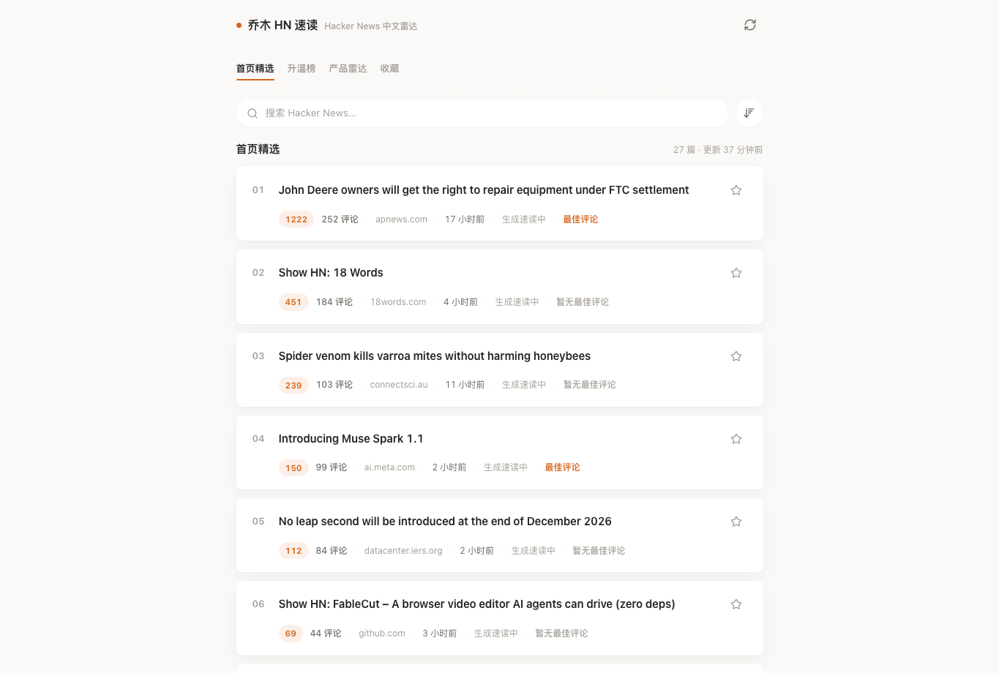
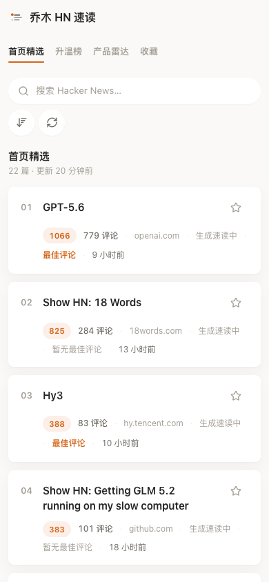

# 乔木 HN 速读

**中文** | [English](#english)



> 为中文开发者和产品人做的 Hacker News 速读站：每小时同步 HNRSS，提前翻译标题、摘要和评论，把热门讨论整理成可直接阅读的中文速读。
>
> A Chinese-first Hacker News reader that prefetches HNRSS, translates stories and comments, and turns useful discussions into fast Chinese summaries.

[线上体验](https://hn.qiaomu.ai/) · [API 文档](https://hn.qiaomu.ai/api-docs) · [健康检查](https://hn.qiaomu.ai/api/health) · [HNRSS](https://hnrss.org/) · [License](LICENSE)

**已验证:** `npm run build`、`SMOKE_BASE_URL=https://hn.qiaomu.ai npm run smoke:api`、桌面/移动端 Playwright 截图检查。

## 这是什么

乔木 HN 速读是一个面向中文用户的 Hacker News 阅读器。它不让用户在首页等待实时翻译，而是在后台按小时同步、过滤、翻译和缓存。打开页面时看到的是已经整理好的中文快照；点击评论时优先读取本地缓存，讨论速读准备好才允许点击。

项目当前部署在 [hn.qiaomu.ai](https://hn.qiaomu.ai/)，也可以自托管为一个 Node.js 服务。

## 核心能力

| 能力 | 用户得到什么 |
|---|---|
| 首页精选 | 直接阅读 HN front page 的中文标题、摘要、热度和来源 |
| 升温榜 | 按 `points`、评论数和发布时间计算当前升温内容 |
| 产品雷达 | 聚合 Show HN / Launch HN / 产品工具相关内容 |
| 评论缓存 | 后台预抓热门帖评论，点击 `xx 评论` 秒开全部评论 |
| 讨论速读 | 把评论转写成中文摘要，只在文章已生成时开放点击 |
| 精选评论观点 | 在速读下方引用高价值评论的核心观点，辅助判断是否继续读 |
| 最佳评论 | 从缓存评论里按长度、观点密度、经验/取舍信号选出最多 4 条 |
| 收藏 | 纯本地 `localStorage` 收藏，不需要登录 |
| 风险过滤 | 默认过滤政治、军事和高争议社会议题，降低公开站运营风险 |
| PWA 安装 | manifest、maskable 图标、Apple touch icon、离线兜底页和 service worker 缓存 |
| SEO 基础 | canonical、Open Graph、JSON-LD、robots.txt、sitemap.xml 和分享图 |

## 产品截图

### 桌面阅读流


### 移动端



## 后台运行逻辑

默认配置下，服务启动后会延迟执行一次后台预热，之后每 1 小时刷新一次：

1. 从 HNRSS 拉取 `frontpage`、`active`、`show`、`launches`。
2. 对标题、域名和链接做政治/军事/敏感议题过滤，过滤详情只留在服务端。
3. 调用 DeepSeek `deepseek-v4-flash` 翻译标题和摘要，写入 `.data/feed-snapshot.json`。
4. 选出评论预热候选：优先首页前 70%，再按 `points * 1.2 + comments * 2.4 - ageHours * 1.8` 排序补齐。
5. 每个候选默认抓取前 24 条评论，翻译评论并生成讨论速读文章。
6. 讨论文章按帖子和评论内容签名缓存到 `.data/discussion-articles.json`；评论没变则直接复用。

前端不会实时调用 DeepSeek，也不会把 API key 暴露给浏览器。

## 快速开始

```bash
git clone https://github.com/joeseesun/qiaomu-hn-reader.git
cd qiaomu-hn-reader
npm ci
cp .env.example .env
npm run build
npm start
```

打开 `http://127.0.0.1:3000`。

如果没有配置 `DEEPSEEK_API_KEY`，服务仍可运行，但翻译和讨论文章会降级为缓存/英文数据。

## 环境变量

| 变量 | 默认值 | 说明 |
|---|---|---|
| `PORT` | `3000` | Node 服务端口 |
| `PUBLIC_BASE_URL` | `http://127.0.0.1:3000` | 页面 canonical、OpenAPI server 地址 |
| `HN_REFRESH_INTERVAL_MS` | `3600000` | 后台快照刷新周期 |
| `HN_REFRESH_STARTUP_DELAY_MS` | `1000` | 启动后第一次刷新延迟 |
| `HN_STORY_PREFETCH_LIMIT` | `30` | 每个 feed 预抓 story 数 |
| `HN_COMMENT_PREFETCH_LIMIT` | `12` | 每轮预热评论的帖子数 |
| `HN_COMMENTS_PER_STORY` | `24` | 每个帖子缓存评论数 |
| `DEEPSEEK_API_KEY` | 空 | 服务端翻译和讨论速读密钥 |
| `DEEPSEEK_BASE_URL` | `https://api.deepseek.com` | DeepSeek 兼容接口地址 |
| `DEEPSEEK_MODEL` | `deepseek-v4-flash` | 翻译和讨论文章模型 |
| `DATA_DIR` | `.data` | 快照、翻译缓存和讨论文章存储目录 |
| `UMAMI_WEBSITE_ID` | 空 | 可选 Umami 统计 ID |

## API

| Endpoint | 用途 |
|---|---|
| `GET /api/health` | 服务版本、时间和翻译模型状态 |
| `GET /api/status` | 后台 worker、快照、预抓参数 |
| `GET /api/topics` | 内置主题列表 |
| `GET /api/insights` | 升温榜和产品雷达 |
| `GET /api/stories?topic=frontpage` | 从快照读取 story 列表 |
| `GET /api/stories/{id}/comments` | 读取缓存评论、评论译文、最佳评论和讨论速读 |
| `GET /api/openapi.json` | OpenAPI 3.1 描述 |

## 项目结构

```text
src/
  server.ts              Express API and static page renderer
  topics.ts              Built-in HNRSS topics
  services/
    hnrss.ts             HNRSS fetching and parsing
    prefetch.ts          Hourly snapshot worker
    translate.ts         DeepSeek translation cache
    discussion.ts        Discussion article generation
    comments.ts          Best-comment heuristic
    insights.ts          Rising/product radar sections
    risk.ts              Public risk filter
    snapshot.ts          Local snapshot selection
public/
  app.js                 Reader UI
  styles.css             Qiaomu note-reader design system
  lucide-icons.js        Minimal local lucide icon renderer
  manifest.webmanifest   PWA install metadata
  offline.html           Offline fallback page
  icons/                 PWA icons and Apple touch icon
  screenshots/           PWA install screenshots
deploy/
  hn-qiaomu.service      systemd unit example
  nginx-hn.qiaomu.ai.conf
docs/assets/
  qiaomu-hn-desktop.png
  qiaomu-hn-mobile.png
```

## 部署

生产站点当前作为 systemd 服务运行，Nginx 反代到私有端口。示例文件在 `deploy/`。

部署时要保留生产 `.data` 和环境变量：

```bash
npm ci
npm run build
systemctl restart hn-qiaomu
SMOKE_BASE_URL=https://hn.qiaomu.ai npm run smoke:api
```

不要把 `.env`、DeepSeek key、`.data` 快照或服务器环境文件提交到仓库。

## 限制与边界

- HNRSS 不提供单条评论的官方投票数；“最佳评论”和“精选评论观点”使用本地启发式排序，不声称是 HN 官方最高票。
- 首页条目数量取决于当前 HNRSS 快照和风险过滤结果，因此 UI 不提供 20/30/50 这类容易误导的条数筛选。
- 风险过滤是保守规则，不等同于内容审核系统。
- DeepSeek 失败或未配置 key 时，讨论速读会显示“生成速读中”或降级结果。
- 本项目不是 Hacker News 官方产品。

## 贡献

欢迎提交问题和改进建议。这个仓库的主要目标是服务 [hn.qiaomu.ai](https://hn.qiaomu.ai/) 线上阅读体验；改动需要通过 `npm run build`、API smoke 和至少一次真实页面检查。

## 关于向阳乔木

- 网站：[qiaomu.ai](https://qiaomu.ai/)
- 博客：[blog.qiaomu.ai](https://blog.qiaomu.ai/)
- 推荐：[tuijian.qiaomu.ai](https://tuijian.qiaomu.ai/)
- X：[@vista8](https://x.com/vista8)
- GitHub：[@joeseesun](https://github.com/joeseesun)

---

<a name="english"></a>

# Qiaomu HN Reader

Qiaomu HN Reader is a Chinese-first Hacker News reader for developers and product builders. It prefetches HNRSS, translates stories and comments with DeepSeek, caches the result locally, and turns useful comment threads into concise Chinese discussion summaries.

## Try It

- Live site: [hn.qiaomu.ai](https://hn.qiaomu.ai/)
- API docs: [hn.qiaomu.ai/api-docs](https://hn.qiaomu.ai/api-docs)
- Health check: [hn.qiaomu.ai/api/health](https://hn.qiaomu.ai/api/health)

## Features

- Chinese story titles and summaries from cached snapshots.
- Rising and product-radar sections.
- Cached comments and translated comment text.
- AI-generated discussion summaries when available.
- Local-only favorites via `localStorage`.
- Conservative risk filtering for politics, military, and sensitive topics.
- Public JSON API for web and future app clients.

## Run Locally

```bash
git clone https://github.com/joeseesun/qiaomu-hn-reader.git
cd qiaomu-hn-reader
npm ci
cp .env.example .env
npm run build
npm start
```

Open `http://127.0.0.1:3000`.

## Verification

```bash
npm run build
SMOKE_BASE_URL=http://127.0.0.1:3000 npm run smoke:api
```

For a production deployment, set `SMOKE_BASE_URL` to the live URL.

## Important Limits

- HNRSS does not expose official per-comment vote counts. Best comments and quoted viewpoints are local heuristics, not official HN rankings.
- The visible story count depends on the current HNRSS snapshot and the risk filter.
- DeepSeek is optional but required for fresh translations and generated discussion summaries.
- This is not an official Hacker News product.

## License

MIT License. See [LICENSE](LICENSE).
